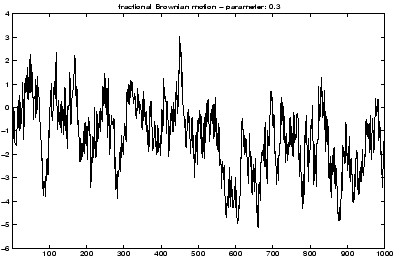



## Fractal \- Brownian line 1D & 2D

### Description

Brownian line is another very simple fractal - lesson 2. This presentation shows the concept of self-similarity on different scales. Code is focused on iterative algorithm and Avi animation (not mine) provide the visual effect of the zoom. Zoom is exluded to preserve simplicity. It is important to get understanding of nature those fractals, algoriths and other characteristics of fractals as later examples will get more complicated. Submission is 550k because of avi animation file.
 
### More Info
 

             |
---                |---
**Submitted On**   |2011-03-16 23:42:30
**By**             |[Dolac](https://github.com/Planet-Source-Code/PSCIndex/blob/master/ByAuthor/dolac.md)
**Level**          |Beginner
**User Rating**    |5.0 (15 globes from 3 users)
**Compatibility**  |VB 6\.0
**Category**       |[Math/ Dates](https://github.com/Planet-Source-Code/PSCIndex/blob/master/ByCategory/math-dates__1-37.md)
**World**          |[Visual Basic](https://github.com/Planet-Source-Code/PSCIndex/blob/master/ByWorld/visual-basic.md)
**Archive File**   |[Fractal\_\-\_2200023182011\.zip](https://github.com/Planet-Source-Code/dolac-fractal-brownian-line-1d-2d__1-73806/archive/master.zip)

